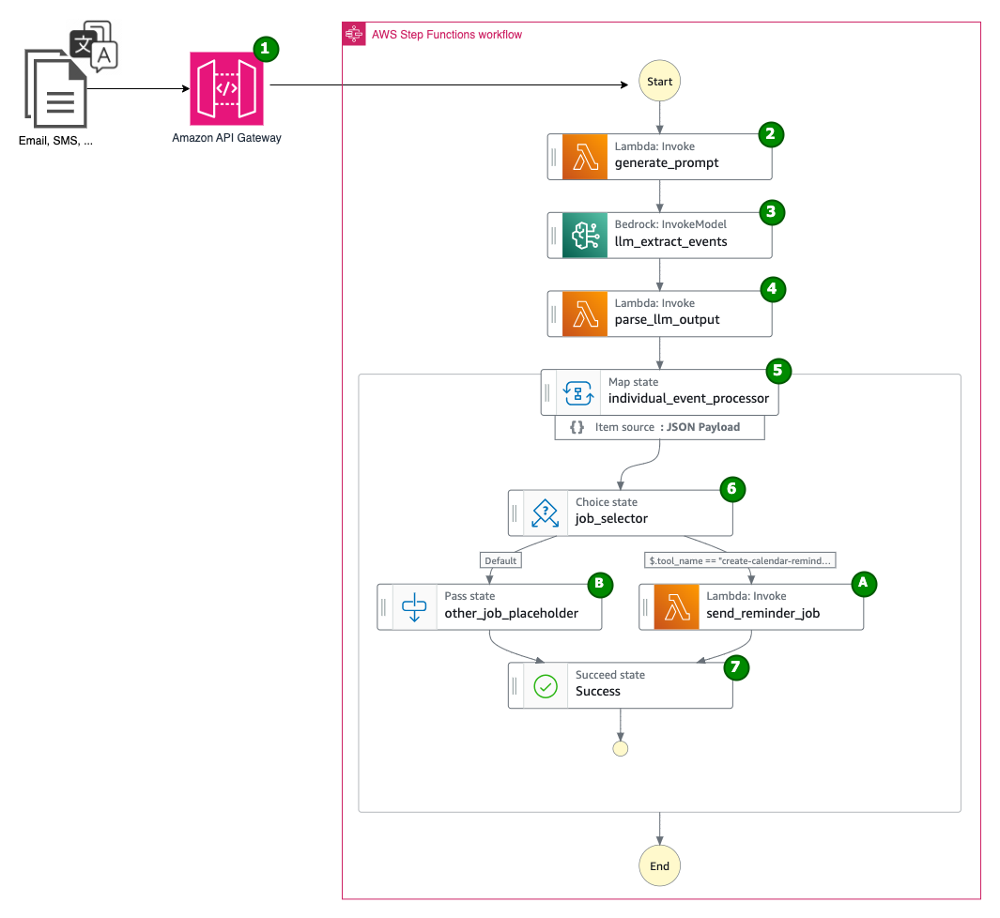
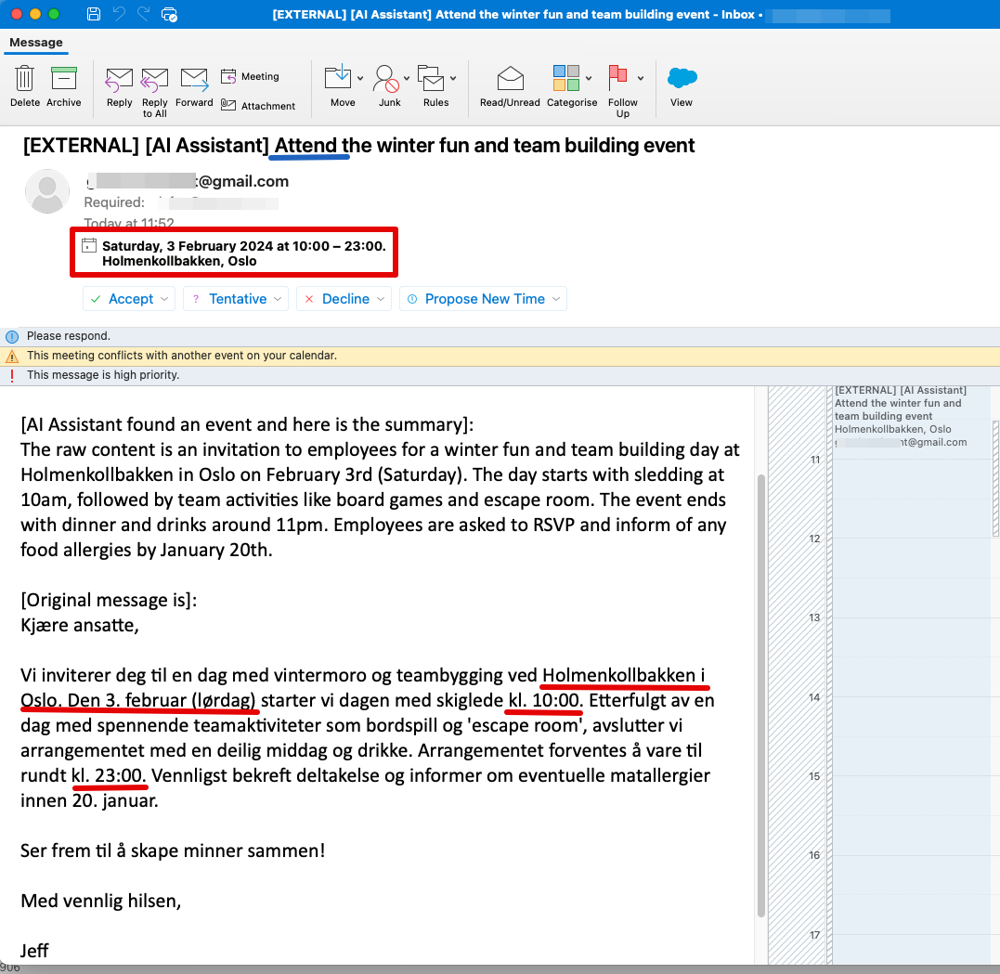
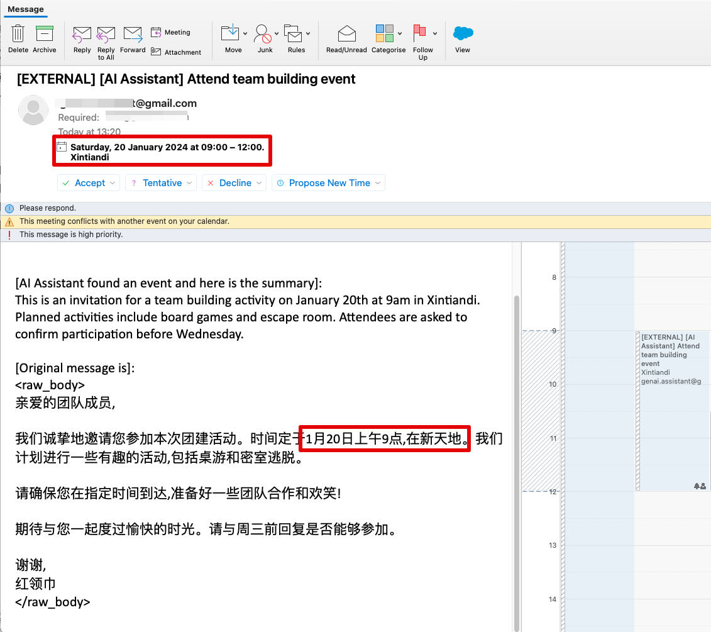

# Build your multilingual personal calendar assistant with Amazon Bedrock and AWS Step Functions

## 1. Introduction
Foreigners and expats living in a foreign country are dealing large number of emails in various languages daily. They often find themselves struggling with language barriers when it comes to setting up reminders for events like business gathering and customer meetings. To solve the problem, this post shows how to apply AWS services such as Amazon Bedrock, AWS Step Functions and Amazon Simple Email Service (AWS SES) to build a fully-automated multilingual calendar AI assistant. It understands the incoming messages, translate that to preferred language and automatically setup calendar reminders.  

## 2. Architecture


### Workflow:
1. The original message ([example](./doc/sample-inputs/norsk1.json)) is sent to AWS Step Functions State Machine by using Amazon API Gateway. 
2. Use a [Lambda function](./src/lambda/prompt_generator/prompt_generator.py) to generate prompt which includes system instruction, original message and other needed information such as current date/time. (Here is the [generated prompt](./src/lambda/prompt_generator/generated_prompt_example.json) from the example message. As it is using Anthropic Claude 3, the generated prompt follows the [Anthropic Claude Messages API](https://docs.aws.amazon.com/bedrock/latest/userguide/model-parameters-anthropic-claude-messages.html) format)
3. Invoke Bedrock foundation model (FM) to:
    - translate and summarize the original message in English. 
    - from the original message, extract event(s) information such as subject, location and time.
    - generate action plan list for event(s), for example: send a calendar reminder email for attending an event.
4. [Parse](./src/lambda/llm_output_parser/llm_output_parser.py) the FM output to ensure it has a valid schema. (Here is the [parsed result](./src/lambda/llm_output_parser/parsed_result_example.json) of the sample message)
5. Iterate the action plan list, execute step 6 for each item.
6. Select the right tool to do the job:
    - If the action is "create-calendar-reminder", then execute A to send out calendar reminder email by using [Lambda Function](./src/lambda/send_calendar_reminder/send_calendar_reminder.py).
    - In the future, you can extend the solution to support other actions in B.
7. Done

## 3. Deployment instructions
You can deploy the solution by using AWS Cloud Development Kit (AWS CDK) in this repository.

> **Warning**
> This application is not ready for production use. It was written for demonstration and educational purposes. Consult with your security team before deploying this stack. No warranty is implied in this example.

> **Note**
> This architecture creates resources that have costs associated with them. Please see the [AWS Pricing](https://aws.amazon.com/pricing/) page for details and make sure to understand the costs before deploying this stack.


### 3.1 Prerequisite
- [Amazon Bedrock access setup](https://docs.aws.amazon.com/bedrock/latest/userguide/model-access.html) for Anthropic's Claude 3 Sonnet model in the deployment region
- [Create and verify identities in Amazon SES](https://docs.aws.amazon.com/ses/latest/dg/creating-identities.html): If your Amazon SES is in sandbox mode, you need to verify YOUR_SENDER_EMAIL and YOUR_RECIPIENT_EMAIL in SES. You will also pass the YOUR_SENDER_EMAIL and YOUR_RECIPIENT_EMAIL as parameters during CDK deployment:
    - Go to [Amazon SES console](https://console.aws.amazon.com/ses)
    - Select **Configuration->Identities** from the left navigation section, then click **Create identity**
    - In the **Create identity** page, select *Email address* as **Identity type**
    - Type the address of YOUR_SENDER_EMAIL in **Email address** text box, the click **Create identity**
    - Soon you will receive an email with subject "Amazon Web Services – Email Address Verification Request". Click the URL to confirm the email address.
    - Repeat above steps for YOUR_RECIPIENT_EMAIL.


### 3.2 Deploy the CDK stack
1. You can run the following deployment steps from your local environment (assuming it has AWS CLI and CDK installed and configured), or you can run it from an [AWS Cloud 9](https://aws.amazon.com/cloud9/) environment.

2. In the chosen environment, [set up](cdk-readme.md) a python virtual environment and install the packages for this solution. 

3. Synthesize the CloudFormation template and deploy
Use your actual email addresses, and also specify the timezone that the assistant should use for creating calendar reminders. For example, "Europe/Oslo" or "Asia/Shanghai"
```
senderEmail=[YOUR_SENDER_EMAIL] 
recipientEmail=[YOUR_RECIPIENT_EMAIL]
assistantTimezone=Europe/Oslo 
cdk deploy --parameters senderEmail=$senderEmail --parameters recipientEmail=$recipientEmail --parameters assistantTimezone=$assistantTimezone
```

Take the note of the output of API Gateway endpoint "GenaiCalendarAgentStack.APIUrl", you will need it for testing and/or connect to your email webhook.
```bash
# Outputs:
# GenaiCalendarAgentStack.APIUrl = https://[random_value].execute-api.[region].amazonaws.com/prod/
# GenaiCalendarAgentStack.GeneratedAPIKeyValue = [random_value]
```

## 4. Test the solution 
You can test the solution by calling API Gateway endpoint, use [one of the sample inputs](./doc/sample-inputs/)

```
apigw=[THE_VALUE_OF_GenaiCalendarAgentStack.APIUrl]
apikey=[THE_VALUE_OF_GenaiCalendarAgentStack.GeneratedAPIKeyValue]

curl -v $apigw --header "Content-Type: application/json" --header "x-api-key:$apikey" -d @./doc/sample-inputs/norsk1.json 
curl -v $apigw --header "Content-Type: application/json" --header "x-api-key:$apikey" -d @./doc/sample-inputs/chinese1.json 
curl -v $apigw --header "Content-Type: application/json" --header "x-api-key:$apikey" -d @./doc/sample-inputs/english1.json 
```

Within 1-2 min, email invitations should be sent to YOUR_RECIPIENT_EMAIL address from YOUR_SENDER_EMAIL. The invitation also use the timezone that you specified during deployment.

### 4.1 Screenshots
Generated calendar reminder from an email in Norwegian


Generated calendar reminder from an email in Chinese


## 5. (Optional) Connect email webhook
Thanks to the API Gateway, there are many ways to integrate this GenAI calendar assistant with your current workflow, such as Microsoft Power App, Gmail webhook, Amazon SNS and directly API call. 

Here we demonstrate to use Zapier Email webhook, for connecting an email inbox with this GenAI calendar assistant. Please [follow the instruction at here](./doc/zapier-setup/readme.md).


## 6. Clean up
From the root directory of the source code, run:
```
cdk destroy
```

## Security

See [CONTRIBUTING](CONTRIBUTING.md#security-issue-notifications) for more information.

## License

This library is licensed under the MIT-0 License. See the [LICENSE](LICENSE.md) file.

## DISCLAIMER

The solution architecture sample code is provided without any guarantees, and you're not recommended to use it for production-grade workloads. The intention is to provide content to build and learn. Be sure of reading the licensing terms.